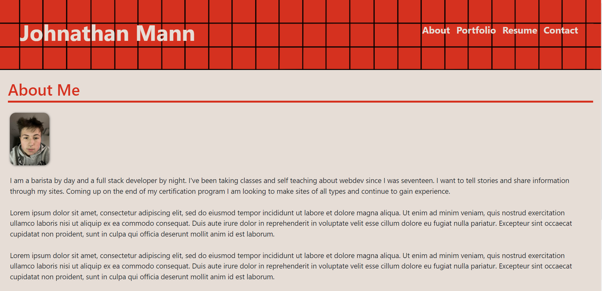

# react-portfolio

This project was completed for KU's coding boot camp assignment 20, and to display my projects.

The goal of this project was to create a responsive website that displays my portfolio as a web dev.

## Check out the Project
Check out the different aspects of the project below:

- [GitHub Page](https://johnathanmann.github.io/react-portfolio/)
- [Repository](https://github.com/johnathanmann/react-portfolio)

## Summary
This site displays my portfolio, resume, and info about me. Aditionally it lets you contact me.

